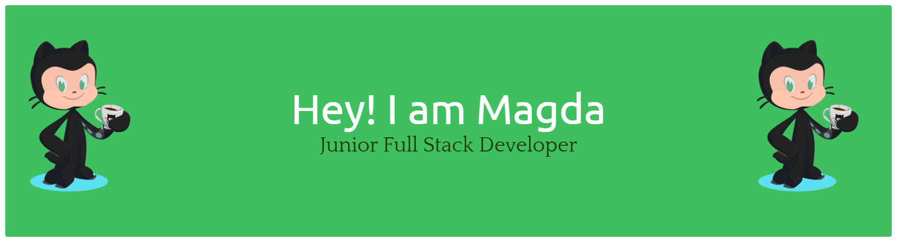

## Hi there 👋 I'm Magda

🌿  **Junior Full Stack Software Developer | Lifelong Learner**  🌿

### 👨‍💻 About Me

- ☕ Can’t start my day without coffee.
- 🌱 I’m currently learning Django
- 💡 Interested in: Web development and building cool apps
- ⚡ Fun fact: ⌨️ I learned to code by breaking stuff first, fixing it later 😅
                💡 I once solved a bug at 3 AM and forgot how by the morning 🤣🤣🤣

- ⌨️ My projects:
    - https://github.com/Magda-R-bit/balance_your_life
    - https://github.com/Magda-R-bit/memory-card-game
    - https://github.com/Magda-R-bit/Chef_Secret_Recipes
    - https://github.com/Magda-R-bit/Wild-Wellness
    - https://github.com/Magda-R-bit/Plant-Wise

### 🌐 Connect with Me
- 💼 [LinkedIn](https://www.linkedin.com/in/magdalena-redka-b97b9455/)
- 📫 How to reach me: magda.redka@gmail.com

